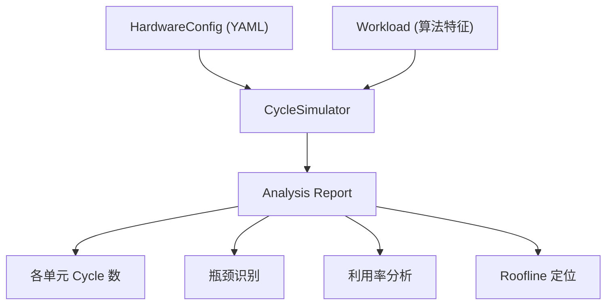

# GPU Cycle-Level 性能仿真器 (SimpleSim)

## 核心思想

给定 **硬件模型**（各计算/存储单元的吞吐率，单位 ops/cycle 和 bytes/cycle）和 **算法特征**（各类型计算总量 + 访存量），仿真器计算每种资源所需的 cycle 数，通过瓶颈模型确定总执行时间。

**关键改进**：内存流量建模参考 FlashAttention-4 论文 (Zadouri et al., 2026) 的 "Feeds and Speeds" 分析方法。不是简单地用"总数据量 / 带宽"，而是精确建模 **MMA 指令对 shared memory 操作数的多次读取**——当 MMA tile 无法一次覆盖整个矩阵时，操作数会被重复读取多次。

## 架构设计




## 1. 硬件模型 (`simplesim/hardware.py`)

用 Python dataclass 定义，支持 YAML 配置加载。参考已有的 `[vis/config/hardware/h100.yaml](vis/config/hardware/h100.yaml)` 风格。

**核心数据结构**：

```python
@dataclass
class ComputeUnit:
    name: str                    # 如 "tensor_core", "cuda_core", "sfu"
    ops_per_cycle: float         # 吞吐率 (ops/cycle)
    supported_dtypes: list[str]  # 如 ["fp16", "bf16", "fp8"]

@dataclass
class MemoryLevel:
    name: str                    # 如 "hbm", "l2_cache", "shared_memory"
    bandwidth_bytes_per_cycle: float  # 吞吐率 (bytes/cycle)
    capacity_bytes: int | None   # 容量（可选）

@dataclass
class GPUConfig:
    name: str
    num_sms: int
    clock_ghz: float             # 用于将 cycle 换算为实际时间
    compute_units: dict[str, ComputeUnit]   # "tensor_core" -> ComputeUnit
    memory_levels: dict[str, MemoryLevel]   # "hbm" -> MemoryLevel
```

**YAML 配置示例** (`configs/h100.yaml`)：

```yaml
name: "H100 SXM"
num_sms: 132
clock_ghz: 1.83

compute_units:
  tensor_core:
    ops_per_cycle: 1024    # FP16: 每SM每cycle的ops
    supported_dtypes: [fp16, bf16, fp8, tf32]
  cuda_core:
    ops_per_cycle: 128     # FP32 FMAC
    supported_dtypes: [fp32, fp16, int32]
  sfu:
    ops_per_cycle: 16      # exp, sin, cos, rsqrt 等
    supported_dtypes: [fp32]

memory_levels:
  hbm:
    bandwidth_bytes_per_cycle: 128   # 全局带宽 / SM数 / 时钟
    capacity_bytes: 85899345920      # 80GB
  l2_cache:
    bandwidth_bytes_per_cycle: 512
    capacity_bytes: 52428800         # 50MB
  shared_memory:
    bandwidth_bytes_per_cycle: 1024
    capacity_bytes: 233472           # 228KB per SM
```

> 注：`ops_per_cycle` 和 `bandwidth_bytes_per_cycle` 均为 **per-SM** 粒度，全芯片吞吐 = per-SM 值 x num_sms。

## 2. 算法工作负载 (`simplesim/workload.py`)

工作负载模型分为两层：**基础模式**（直接给总量）和 **MMA-aware 模式**（精确建模 shared memory 重复读取）。

### 2.1 基础工作负载

用户直接指定各单元的总操作量/总字节数，适合快速估算：

```python
@dataclass
class Workload:
    name: str
    compute_ops: dict[str, int]    # 计算单元名 -> 总ops数
    memory_bytes: dict[str, int]   # 存储层级名 -> 总bytes数
```

### 2.2 MMA-aware 内存流量模型（参考 FA-4 Feeds and Speeds）

核心思想：当一个 MMA 输出 tile 需要多条 MMA 指令完成时，shared memory 操作数会被**重复读取**。这不是简单的"矩阵大小 x 元素字节数"。

**以 FlashAttention forward 为例**（论文 Section 3.1.1, 公式 1-3）：

对于 tile 大小 M x N，head dim = d，MMA 硬件 tile = 128x128：

- **MMA compute**: `T_mma = 4MNd / 8192` cycles（QK^T + PV 两个 GEMM，每个 2MNd FLOPS）
- **SMEM traffic**: QK^T 是 SS（两个操作数都从 SMEM 读），需要 `ceil(M/128) * ceil(N/128)` 条 MMA 指令，每条读 `128*d + 128*d` 元素；PV 是 TS（A 从 TMEM，B 从 SMEM），需要 `ceil(M/128) * ceil(d/128)` 条指令，每条读 `128*N` 元素。总 SMEM 读取 = `ceil(M/128)*ceil(N/128)*256d + ceil(M/128)*ceil(d/128)*128N` 元素
- **当 M=N=d=128 时**：SMEM = `1*1*256*128 + 1*1*128*128 = 49152` 元素 = 96KB，对应 768 cycles
- **当 M=256, N=d=128 时**：SMEM = `2*1*256*128 + 2*1*128*128 = 98304` 元素 = 192KB，对应 1536 cycles（操作数被读了 2 次！）

```python
@dataclass
class MMAOp:
    """描述一个矩阵乘法操作的 shared memory 访问模式"""
    name: str
    output_shape: tuple[int, int]       # (M, N) 输出 tile 大小
    reduction_dim: int                   # K 维度（内积维度）
    operand_a_source: str                # "smem" | "tmem" | "rmem"
    operand_b_source: str                # "smem" | "tmem" | "rmem"
    dtype_bytes: int                     # 元素字节数 (bf16=2, fp8=1)
    hw_tile_m: int = 128                 # 硬件 MMA tile M 维度
    hw_tile_n: int = 128                 # 硬件 MMA tile N 维度

    def smem_bytes(self) -> int:
        """计算此 MMA 操作实际产生的 SMEM 读取字节数（含重复读取）"""
        num_tiles_m = math.ceil(self.output_shape[0] / self.hw_tile_m)
        num_tiles_n = math.ceil(self.output_shape[1] / self.hw_tile_n)
        K = self.reduction_dim
        bytes_per_tile = 0
        if self.operand_a_source == "smem":
            bytes_per_tile += self.hw_tile_m * K * self.dtype_bytes
        if self.operand_b_source == "smem":
            bytes_per_tile += K * self.hw_tile_n * self.dtype_bytes
        return num_tiles_m * num_tiles_n * bytes_per_tile

    def compute_ops(self) -> int:
        M, N = self.output_shape
        return 2 * M * N * self.reduction_dim

@dataclass
class TiledWorkload:
    """MMA-aware 工作负载，精确建模 SMEM 重复读取"""
    name: str
    mma_ops: list[MMAOp]                # 所有 MMA 操作
    elementwise_ops: dict[str, int]     # "sfu" -> exp 次数, "cuda_core" -> 向量 ops
    hbm_bytes: int                       # HBM 总读写量
    extra_smem_bytes: int = 0            # 非 MMA 的额外 SMEM 流量（如 dS 写回）
```

**使用示例**（FlashAttention-4 forward, M=256, N=d=128）：

```python
fa4_fwd = TiledWorkload(
    name="fa4_forward_M256_N128_d128",
    mma_ops=[
        MMAOp("QKt", output_shape=(256, 128), reduction_dim=128,
              operand_a_source="smem", operand_b_source="smem", dtype_bytes=2),
        MMAOp("PV",  output_shape=(256, 128), reduction_dim=128,
              operand_a_source="tmem", operand_b_source="smem", dtype_bytes=2),
    ],
    elementwise_ops={
        "sfu": 256 * 128,       # exp operations for softmax
        "cuda_core": 256 * 128, # max, sub, sum 等向量运算
    },
    hbm_bytes=(256 + 128 + 128) * 128 * 2 + 256 * 128 * 2,  # 读 Q,K,V + 写 O
)
# 仿真器自动计算：
#   MMA cycles = sum(op.compute_ops()) / 8192 = 4*256*128*128/8192 = 2048
#   SMEM cycles = sum(op.smem_bytes()) / 128  = (2*1*256*128*2 + 2*1*128*128*2) / 128 = 1536
#   SFU cycles  = 256*128 / 16 = 2048
#   瓶颈: MMA 和 SFU 并列 (2048 cycles)，与论文 Table 1 完全一致
```

## 3. 仿真引擎 (`simplesim/simulator.py`)

**核心逻辑**：

```python
@dataclass
class UnitCycleResult:
    unit_name: str
    total_ops_or_bytes: int
    throughput_per_cycle: float
    cycles: int                    # = ceil(total / throughput)
    time_us: float                 # = cycles / clock_ghz / 1000

@dataclass
class SimResult:
    workload_name: str
    compute_cycles: dict[str, UnitCycleResult]  # 各计算单元
    memory_cycles: dict[str, UnitCycleResult]    # 各存储层级
    bottleneck_unit: str           # 瓶颈单元名
    total_cycles: int              # 由瓶颈决定
    total_time_us: float
    utilization: dict[str, float]  # 各单元利用率 = 自身cycles / total_cycles
```

**仿真流程**：

仿真器支持两种输入模式，对应 `Workload`（基础）和 `TiledWorkload`（MMA-aware）：

### 基础模式 (Workload)

1. **Cycle 计算**：对每个计算/存储单元，`cycles = ceil(total_ops / (ops_per_cycle * num_sms))`
2. **瓶颈识别**：`total_cycles = max(所有单元的 cycles)`
3. **利用率**：每个单元的 `utilization = 自身 cycles / total_cycles`
4. **时间换算**：`time_us = total_cycles / (clock_ghz * 1e3)`

### MMA-aware 模式 (TiledWorkload)

1. **MMA compute cycles**：`sum(op.compute_ops() for op in mma_ops) / hw.tensor_core.ops_per_cycle`
2. **SMEM cycles（含重复读取）**：`sum(op.smem_bytes() for op in mma_ops) + extra_smem_bytes) / hw.smem.bandwidth_bytes_per_cycle`——这里 `smem_bytes()` 已经考虑了 MMA tiling 导致的操作数重复读取
3. **SFU/CUDA Core cycles**：`elementwise_ops[unit] / hw.unit.ops_per_cycle`
4. **HBM cycles**：`hbm_bytes / hw.hbm.bandwidth_bytes_per_cycle`（全芯片共享，不乘 num_sms）
5. **瓶颈识别**：`total_cycles = max(mma_cycles, smem_cycles, sfu_cycles, cuda_cycles, hbm_cycles)`

> 这是 FlashAttention-4 论文中 "Feeds and Speeds" 的分析方法：精确建模每个硬件资源的 cycle 消耗，瓶颈由最慢资源决定。与简单的 Roofline 不同，SMEM 流量考虑了 MMA 指令对操作数的重复读取次数。

## 4. 分析与报告 (`simplesim/analysis.py`)

提供两种输出：

- **文本报告**：表格形式打印各单元 cycle 数、利用率、瓶颈标识
- **Roofline 定位**：计算算术强度 (AI = total_compute_ops / total_memory_bytes)，在 Roofline 图上标注工作点

**TiledWorkload 报告示例**（复现论文 Table 1）：

```
============ SimpleSim Report: fa4_forward_M256_N128_d128 ============
Hardware: B200 (148 SMs @ 1.85 GHz)  |  Per-SM Analysis

Resource          | Total Traffic     | Throughput/cyc   | Cycles | Util%
------------------|-------------------|------------------|--------|------
MMA compute       | 16,777,216 ops    | 8192 ops/cyc     |  2048  | 100% <<<
SMEM (MMA reads)  | 196,608 bytes     | 128 B/cyc        |  1536  | 75.0%
  QKt (SS)        |   131,072 bytes   |   (2x128x128x2)  |  1024  |
  PV  (TS)        |    65,536 bytes   |   (2x128x128x2)  |   512  |
SFU (exp)         | 32,768 ops        | 16 ops/cyc       |  2048  | 100% <<<
CUDA Core         | 32,768 ops        | 128 ops/cyc      |   256  | 12.5%
HBM               | 196,608 bytes     | ...              |   ...  | ...

Bottleneck: MMA compute + SFU (tied at 2048 cycles)
SMEM amplification: 1.5x (vs naive data size, due to MMA operand re-reads)
```

> 注意 SMEM 行展示了每个 MMA 操作的贡献，以及"放大因子"——实际 SMEM 流量相对于矩阵原始大小的倍数。这正是论文强调的：当 tile 变大（M=256），MMA 指令数翻倍，SMEM 操作数被重复读取。

## 5. 项目结构

```
SimpleSim/
├── simplesim/
│   ├── __init__.py
│   ├── hardware.py          # GPUConfig, ComputeUnit, MemoryLevel
│   ├── workload.py          # Workload + MMAOp + TiledWorkload
│   ├── simulator.py         # CycleSimulator 核心引擎（基础 + MMA-aware）
│   └── analysis.py          # 报告生成、Roofline 定位
├── configs/
│   ├── h100.yaml            # H100 Hopper 硬件配置
│   └── b200.yaml            # B200 Blackwell 硬件配置（FA-4 论文参数）
├── examples/
│   └── flash_attention.py   # FA-4 forward/backward 工作负载，验证论文 Table 1/3
├── requirements.txt         # pyyaml, tabulate
└── README.md
```

## 6. 关键设计决策

- **per-SM 粒度**：所有吞吐率以 per-SM 为单位定义，仿真时乘以 SM 数量，这样更直观且与硬件手册对应
- **瓶颈模型（取 max）**：假设各硬件单元可完全流水线重叠，总时间由最慢的单元决定
- **MMA-aware SMEM 建模**（来自 FA-4 论文）：SMEM 流量不等于"矩阵大小 x 字节数"，而是 `num_mma_tiles x per_tile_operand_bytes`。当输出 tile 大于硬件 MMA tile 时，操作数被重复读取。这解释了为什么 M=256 时 SMEM 流量翻倍（从 768 到 1536 cycles）
- **区分 SS/TS MMA**：SS（shared-shared）两个操作数都从 SMEM 读，TS（tensor-shared）只有 B 操作数从 SMEM 读，A 从 TMEM 读（零 SMEM 开销）。这对 Blackwell 架构尤为重要
- **纯 Python 实现**：无需 CUDA，仅依赖 `pyyaml` 和 `tabulate`，轻量易用
- **可扩展**：后续可添加 2-CTA MMA 模式（SMEM 流量再减半）、DSMEM 交换、wave quantization、bank conflict 等更精细的建模

## 7. 论文验证：FA-4 Table 1 复现

作为正确性验证，仿真器应能复现论文 Table 1 的结果：


| Resource         | M=N=d=128 (论文) | M=256,N=d=128 (论文) |
| ---------------- | -------------- | ------------------ |
| MMA compute      | 1024 cycles    | 2048 cycles        |
| Shared memory    | 768 cycles     | 1536 cycles        |
| Exponential unit | 1024 cycles    | 2048 cycles        |


公式推导（per-SM, per-tile）：

- `T_mma = 4MNd / 8192`（公式 1：两个 GEMM 各 2MNd ops）
- `T_smem = 3MNd / 8192`（公式 2：SS 读 Q+K，TS 读 V，考虑 MMA tile 重复读取后化简）
- `T_exp = MN / 16`（公式 3：softmax 中的 exp 操作）

